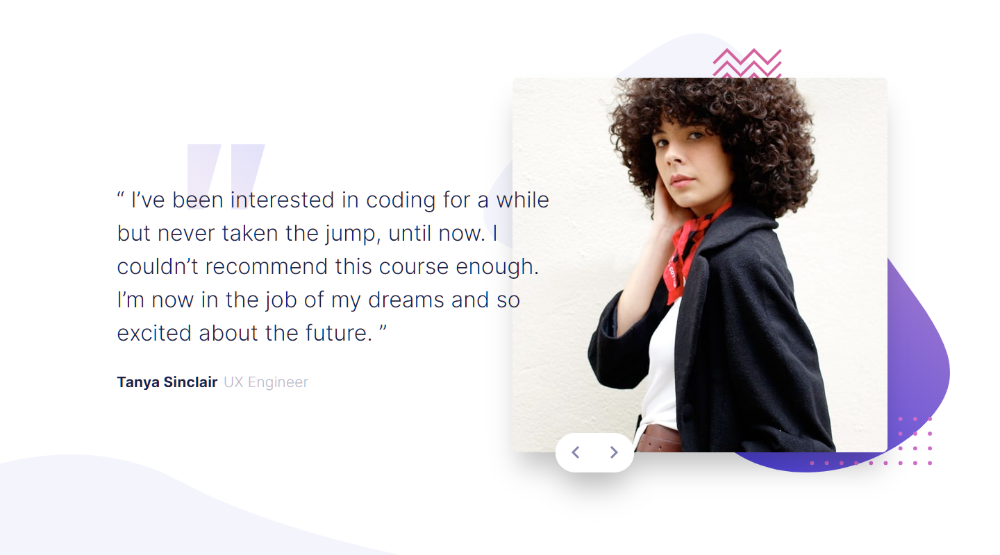

# Frontend Mentor - Coding bootcamp testimonials slider solution

This is a solution to the [Coding bootcamp testimonials slider challenge on Frontend Mentor](https://www.frontendmentor.io/challenges/coding-bootcamp-testimonials-slider-4FNyLA8JL). Frontend Mentor challenges help you improve your coding skills by building realistic projects. 

## Table of contents

- [Overview](#overview)
  - [The challenge](#the-challenge)
  - [Screenshot](#screenshot)
  - [Links](#links)
- [My process](#my-process)
  - [Built with](#built-with)
  - [What I learned](#what-i-learned)
  - [Useful resources](#useful-resources)
- [Author](#author)

**Note: Delete this note and update the table of contents based on what sections you keep.**

## Overview

### The challenge

Users should be able to:

- View the optimal layout for the component depending on their device's screen size
- Navigate the slider using either their mouse/trackpad or keyboard

### Screenshot



### Links

- HTML Solution URL: [HTML](https://github.com/JustANipple/coding-bootcamp-testimonials-slider/blob/main/index.html)
- CSS Solution URL: [CSS](https://github.com/JustANipple/coding-bootcamp-testimonials-slider/blob/main/style/style.css)
- JavaScript Solution URL: [JS](https://github.com/JustANipple/coding-bootcamp-testimonials-slider/blob/main/script/script.js)
- Live Site URL: [LIVE](https://justanipple.github.io/coding-bootcamp-testimonials-slider/)

## My process

### Built with

- Semantic HTML5 markup
- CSS custom properties
- Flexbox
- Mobile-first workflow
- JavaScript

### What I learned

I've played on animations and transition to give the image and text change a bit more smooth, so i worked with setTimeout to achieve a good looking animation
The animation accepts two buttons, which decide if the animation goes left or right

This is the JS code of the animation:
```js
function changeContent(direction) {
    let offset = 0;
    if(direction === "right") {
        offset = -5;
    } else if (direction === "left") {
        offset = 5;
    }
    for(const elem of elements) {
        elem.style.transform = "translateX(" + offset +  "rem)";
        elem.style.opacity = "0";
        setTimeout(() => {
            elem.style.transform = "translateX(" + offset * -1 + "rem)";
        }, 250);
    }

    setTimeout(() => {
        image.setAttribute("src", reviews[index].img);
        testName.textContent = reviews[index].name;
        testJob.textContent = reviews[index].job;
        testReview.textContent = reviews[index].review;
    }, 250);

    setTimeout(() => {
        for(const elem of elements) {
            elem.style.transform = "translateX(0)";
            elem.style.opacity = "1";
        }
    }, 500);
}
```

### Useful resources

- [PowerToys](https://github.com/microsoft/PowerToys) - I use this Microsoft tool to check colors, take measures and much more that makes coding much easier
- [PerfectPixel](https://chrome.google.com/webstore/detail/perfectpixel-by-welldonec/dkaagdgjmgdmbnecmcefdhjekcoceebi) - I use this extension to check if my site looks close to the design. You just need to link the image from the design folder!

## Author

- Frontend Mentor - [@JustANipple](https://www.frontendmentor.io/profile/JustANipple)
